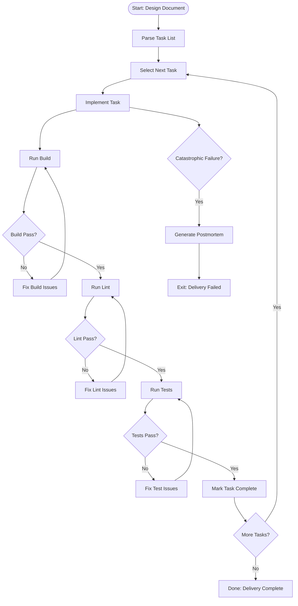

# Delivery

## Purpose
Execute the validated technical implementation plan from the Design phase by systematically completing atomic tasks, ensuring code quality at each step, and producing production-ready code that meets all specifications. Goal: transform the FACTS-qualified task breakdown into working, tested, and deployable code.

## Primary Objective
Execute the Design phase output by:
- Implementing each atomic task in proper sequence or parallel groupings.
- Validating build, lint, and test success after each task completion.
- Tracking progress through checkbox completion in the design document.
- Maintaining code quality standards throughout implementation.
- Producing a fully functional solution ready for deployment.

## Input Artifact
Location: thoughts/[problem-short-name]/design.md
Requirements: Must have passed FACTS Scale validation (Mean >= 3.00)

## Output
No output artifact under normal execution.
- Tasks in design.md marked complete (`- [ ]` -> `- [x]`)
- Implemented, tested, production-ready code
- All build, lint, and test suites passing

### Catastrophic Failure Output
Location: thoughts/[problem-short-name]/delivery-postmortem.md
Generated only when delivery cannot proceed due to blocking issues.
Contents:
- Failed task identification
- Error messages and stack traces
- Codebase state at failure point
- Root cause analysis
- Suggested 3D Strategy prompt for resolution
- Remediation recommendations

## Task Execution Strategy

### Serial Execution (Primary Approach)
Execute tasks sequentially as listed in design.md. Each task must complete successfully before proceeding to the next. This ensures:
- Clear progress tracking
- Immediate issue identification
- No compounding errors
- Simpler debugging when issues arise

> **Parallel Execution Note:** Tools like Claude Code can execute independent tasks simultaneously using sub-agents. Tasks marked with `[P]` in the same phase can run in parallel if they affect different files and have no shared dependencies. Maximum 5 parallel tasks at once.

### Task Identification
- Tasks are defined as checkbox items in design.md
- Format: `- [ ] Task description`
- Phase boundaries separate task groups
- Tasks within a phase are executed in order

### Dependency Management
- Respect phase boundaries - complete all tasks in a phase before proceeding
- Within a phase, honor explicit dependencies noted in design.md
- Each task builds on the successful completion of the previous task

### Quality Gates
After each task completion (except "Red" phase of TDD):
1. **Build** must compile/run without errors
2. **Lint** must pass with no violations
3. **Tests** must pass with no failures
4. Update task checkbox to complete (- [x])

If any quality gate fails:
- Fix issues before proceeding to next task
- Do not mark task complete until all gates pass
- Document persistent blockers in postmortem if unresolvable

## Implementation Workflow

### Pre-Execution Validation
1. Verify design.md exists at expected location
2. Confirm FACTS Scale validation passed
3. Parse task breakdown and identify phases
4. Validate all referenced files are accessible

### Task Execution Loop
For each phase in design.md:
1. Identify all tasks in current phase
2. Execute tasks sequentially
3. For each task:
   - Implement specified changes
   - Run build → lint → test pipeline
   - Mark complete only if all pass
   - Handle failures per quality gates
4. Proceed to next phase only when all current phase tasks complete

> **Parallel Execution Note:** When using tools with sub-agent capabilities, tasks marked `[P]` can be batched and executed simultaneously, then results aggregated before proceeding.

### Completion Tracking
- Real-time updates to design.md checkboxes
- Each successful task: `- [ ]` -> `- [x]`
- Failed tasks remain unchecked with noted blockers
- Progress visible through design.md state

## Implementation Workflow Diagram

### Parallel Execution with Sub-Agents
> **Note:** When using tools like Claude Code that support sub-agents, the workflow can be modified to execute independent tasks in parallel:
>
> 1. Identify tasks marked with `[P]` in the current phase
> 2. Launch up to 5 sub-agents simultaneously
> 3. Each agent executes its task and runs quality gates
> 4. Aggregate results when all agents complete
> 5. Mark all successful tasks as complete
> 6. Handle any failures before proceeding to the next phase
>
> This approach can significantly reduce delivery time for projects with many independent tasks while maintaining the same quality standards.

## Quality Assurance

### Continuous Validation
- Every task must pass build, lint, and tests before marking complete
- No accumulation of technical debt during delivery
- Immediate remediation of quality issues
- No proceeding with broken states

### Test Execution Requirements
- Run full test suite after each task (unless TDD "Red" phase)
- Include unit, integration, and e2e tests as defined
- New tests from Design phase must be implemented and passing
- Regression tests must continue passing

### Code Standards
- Follow existing codebase conventions
- Maintain consistent formatting via linter
- Preserve architectural patterns
- No divergence from Design specifications

## Postmortem Generation

When catastrophic failure occurs, generate delivery-postmortem.md with:
- Clear identification of the failed task and phase
- Complete error details and system state at failure
- Root cause analysis
- Recommended solutions and next steps
- Context needed to restart the 3D Strategy process if required

## Anti-Goals
- Don't refactor beyond what's specified in the tasks
- Don't add features not in the task list
- Don't modify the Design document except for checking off completed tasks
- Don't complete multiple phases unless specified to do so
- Don't skip quality gates even under time pressure
- Don't leave tasks partially implemented
- Don't proceed with failing tests
- Don't implement optimizations not in the Design

## Handoff Contract Upon Completion
Delivery phase completes with:
- All tasks in design.md marked complete with [x]
- All tests passing (unit, integration, e2e)
- Build successful with no errors
- Lint passing with no violations
- Code ready for deployment
- No uncommitted changes unless specified
- Documentation updates if specified in tasks

## Reference
Design artifact: thoughts/[problem-short-name]/design.md
FACTS validation: [FACTS Scale for Design](../facts-scale/FACTS-Scale-for-Design.md)