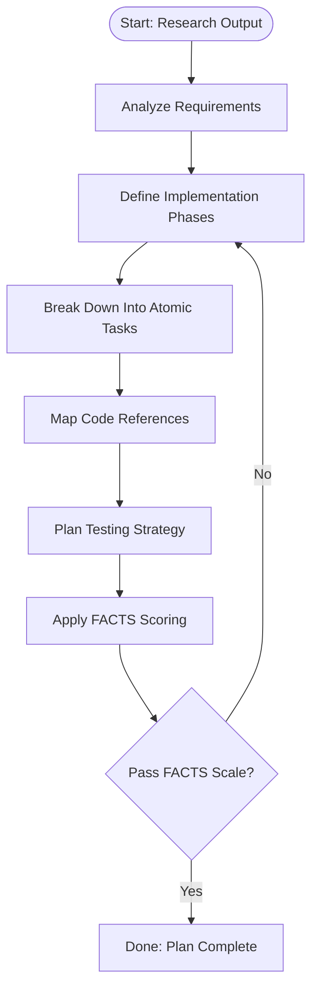

# Plan

## Purpose
Transform Research phase findings into a concrete, executable technical implementation plan with atomic tasks that can be performed by AI coding agents. Goal: create a validated sequence of actionable development tasks that bridge problem understanding to production-ready code delivery.

## Primary Objective
Convert Research phase output into a FACTS-qualified technical implementation plan that:
- Breaks down the solution into atomic, single-responsibility tasks.
- Defines clear execution order with explicit dependencies.
- Provides verifiable completion criteria for each task.
- Ensures tasks are feasible for junior-level developers with context.
- Maintains consistent effort sizing across task groupings.

## Input Artifact
Location: thoughts/[problem-short-name]/discovery.md
Requirements: Must have passed FAR Scale validation (F >= 4, A >= 3, R >= 3, Mean >= 4.00)

## Output Artifact
Location: thoughts/[problem-short-name]/design.md
No frontmatter.
Mandatory heading structure (all H2 under an H1 title):
1. Implementation Overview
2. Task Breakdown
3. Code References
4. Testing Plan
5. FACTS Scale Output
6. Dependencies & Sequencing
7. Risk Mitigation
8. Rollback Strategy

H1 Title Pattern: [TICKET-ID] Plan (if a ticket ID exists; otherwise Use Case Plan).

## Section Definitions

### Implementation Overview
- High-level approach summary derived from Research findings.
- Key architectural decisions and patterns to be implemented.
- Integration points with existing systems.
- Performance and scalability considerations.

### Task Breakdown
Organized into logical phases with atomic tasks using checkboxes.
Each task must be:
- Single responsibility (one clear objective)
- Independently completable by an AI agent
- Verifiable upon completion
- Appropriately sized (atomic units like single file edits or command calls)

Format:
```markdown
## Phase 1: [Phase Name]
- [ ] Task description with specific file paths and changes
- [ ] Next atomic task in sequence
- [ ] Final task in phase

## Phase 2: [Next Phase Name]
- [ ] First task of next phase
```

### Code References
Comprehensive list of all files and locations that will be modified.
Representation: fenced code block using Research phase syntax.
Must include:
- New files to be created
- Existing files requiring modification
- Configuration files needing updates
- Test files to be added or changed

### Testing Plan
Detailed testing strategy for implementation validation:
- Unit tests for new functionality
- Integration tests for system interactions
- End-to-end test scenarios
- Performance test requirements
- Regression test considerations

### FACTS Scale Output
Use the **FACTS Scale** (Feasibility, Atomicity, Clarity, Testability, Size) for planning validation:
- **Feasibility**: Tasks are achievable with available resources and skills
- **Atomicity**: Each task has single, clear responsibility
- **Clarity**: Task descriptions provide unambiguous direction
- **Testability**: Completion criteria are verifiable
- **Size**: Task boundaries are well-defined and appropriately sized

Apply the FACTS Scale for Plan phase validation. Summarized scoring table + pass/fail decision required.

For complete FACTS Scale criteria, scoring rules, and examples: [../scales/facts-scale.md](../scales/facts-scale.md)

*For code validation in the previous phase, see the FAR Scale in Research.md*


### Dependencies & Sequencing
- Inter-task dependencies within and across phases
- Critical path identification
- Parallel execution opportunities
- External system dependencies
- Third-party service requirements

### Risk Mitigation
- Technical risks identified during planning
- Mitigation strategies for each risk
- Contingency plans for high-impact scenarios
- Early warning indicators
- Escalation criteria

### Rollback Strategy
- Rollback points for each phase
- Data migration reversal procedures
- Feature flag configurations
- Database schema rollback scripts
- Service deployment rollback plans

## Code Reference Syntax
Identical to Research phase syntax:

Single location:
path/to/file.ext:LINE or path/to/file.ext:LINE:COL

Line range:
path/to/file.ext:START-END

Line + column range (spanning lines):
path/to/file.ext:START_LINE:START_COL-END_LINE:END_COL

Multiple disjoint ranges (same file):
path/to/file.ext:RANGE1;RANGE2;RANGE3

Entire file (no line):
path/to/file.ext

New files (to be created):
path/to/new/file.ext [NEW]

Presentation:
Fenced code block (```), one entry per line, ordered by implementation sequence.

## Workflow


## Task Sizing Guidelines
- **Phase**: Logical grouping of related tasks (e.g., "Database Layer", "API Endpoints")
- **Task**: Atomic unit of work with single responsibility
- **Sizing**: Each task should be atomic (single file edits, command calls, etc.), with phases balanced for similar complexity
- **Context**: Each task includes enough context for AI agent to execute independently

## Failure Handling

Plan phase failures are classified and handled according to FACTS Scale scores:
- **Minor Failure**: FACTS scores 2.8-2.9 (single iteration task refinement)
- **Major Failure**: FACTS scores 2.0-2.7 (return to Research phase)
- **Critical Failure**: FACTS scores <2.0 (leadership escalation)

Additional triggers include task breakdown failure (non-atomic tasks) and dependency deadlock (circular dependencies).

For complete failure handling procedures, escalation timelines, recovery paths, and postmortem requirements, see: [Failure Handling Framework](../README.md#failure-handling-framework)

## Quality Gates Before Completion
- Every task maps to specific code locations or clear creation instructions
- All tasks are atomic and independently verifiable
- Dependencies are explicitly defined and non-circular
- Testing strategy covers all new functionality
- FACTS table present with numeric values + computed mean
- Rollback strategy defined for each implementation phase
- Failure handling procedures documented if FACTS validation fails

## Minimal FACTS Output Example

```
F: 3  A: 3  C: 2  T: 3  S: 4  Mean: 3.00  --> PASS
```

```
F: 4  A: 2  C: 3  T: 3  S: 3  Mean: 3.00  --> PASS
```

```
F: 2  A: 3  C: 3  T: 3  S: 3  Mean: 2.80  --> FAIL (Mean < 3.00)  (Restart)
```

## Handoff Contract to Implement Phase
Implement phase receives:
- Final design.md with FACTS pass indicators
- Complete task breakdown with checkboxes
- Normalized code references for all changes
- Testing validation criteria for each task
- Rollback procedures and checkpoints
- Dependency ordering for parallel execution

## Anti-Goals
- Writing actual production code (leave to Implement)
- Making implementation decisions better left to coding agents
- Over-specifying solutions that constrain implementation creativity
- Creating tasks too large for single AI agent sessions

## Reference
FACTS rubric: [FACTS Scale](../scales/facts-scale.md)