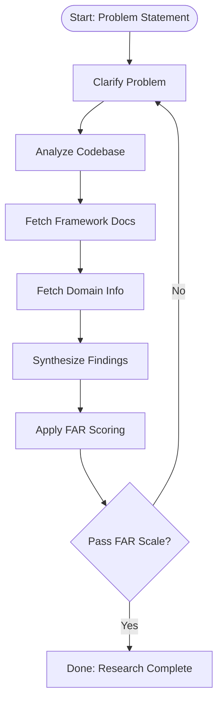
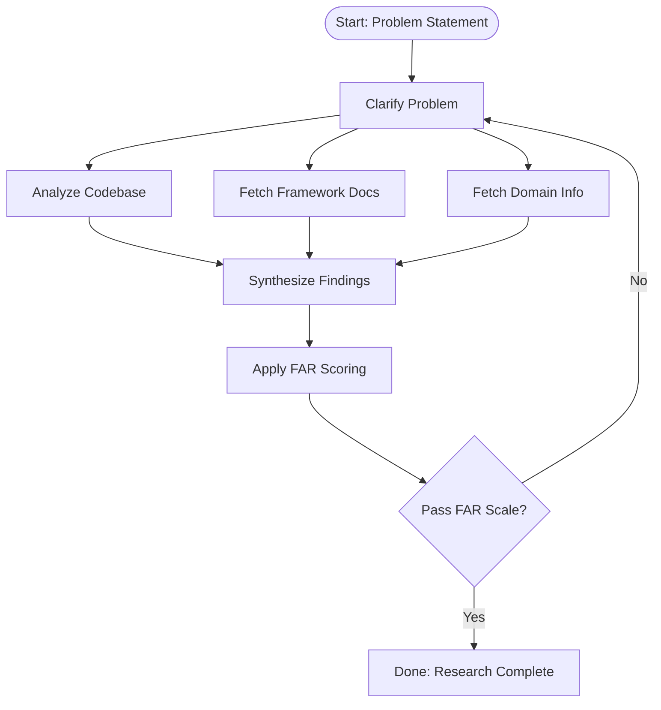

# Research

## Purpose
Establish a high‑fidelity, action‑ready understanding of a problem (ticket / user story / change request) by clarifying scope, mapping affected code surfaces, gathering internal and external technical context, and synthesizing it into a single durable Markdown artifact for the Plan phase. Goal: remove ambiguity before any solutioning.

## Primary Objective
Convert an initial problem statement into a validated, FAR-qualified (Factual, Actionable, Relevant) research document that:
- Identifies precise code locations requiring investigation or change.
- Surfaces exemplar patterns and analogous implementations.
- Provides early testing strategy considerations.
- Highlights candidate design patterns.
- States assumptions and explicitly excludes out‑of‑scope areas.

## Output Artifact
Location: thoughts/[problem-short-name]/discovery.md  
No frontmatter.  
Mandatory heading structure (all H2 under an H1 title):
1. Problem Context  
2. Affected Files  
3. Code Examples  
4. FAR Scale Output  
5. Testing Strategy  
6. Potential Design Pattern Recommendations  
7. Assumptions  
8. Out of Scope  

H1 Title Pattern: [TICKET-ID] Research (if a ticket ID exists; otherwise Use Case Research).

## Section Definitions

### Problem Context
- Restated, clarified problem statement.
- Business / functional intent.
- Current vs desired behavior.
- Constraints (time, performance, compliance, environment).

### Affected Files
List only files / ranges likely impacted or requiring review.
Representation: fenced code block, one reference per line (see “Code Reference Syntax”).

### Code Examples
- Minimal, relevant snippets (avoid full files unless essential).
- Analogous patterns already in the codebase.
- Illustrations of current vs proposed shape (when discernible).
- Use triple backtick code fences inside this section; label language.

### FAR Scale Output
Use the **FAR Scale** (Factual, Actionable, Relevant) for code-focused validation during Research:
- **Factual**: Evidence-based claims with verifiable code references
- **Actionable**: Clear next steps for implementation
- **Relevant**: Solution addresses core user needs and constraints

Apply the FAR Scale for Research phase validation. Summarized scoring table + pass/fail decision required.

For complete FAR Scale criteria, scoring rules, and examples: [../scales/far-scale.md](../scales/far-scale.md)

*For planning validation in the next phase, see the FACTS Scale in Plan.md*

### Testing Strategy
Early hypotheses about:
- Unit test touchpoints
- Integration / contract surfaces
- Observability (logs, metrics, traces)
- Repro steps if defect
- Risk areas needing characterization tests

### Potential Plan Pattern Recommendations
Candidate architectural or code-level patterns (e.g. Strategy, Adapter, CQRS, Guard Clauses) with rationale and internal exemplars if they exist.

### Assumptions
Enumerated, falsifiable statements. Each should be testable or confirmable later.

### Out of Scope
Explicit exclusions to prevent scope creep (subsystems, refactors, deferred concerns).

## Code Reference Syntax

Single location:
path/to/file.ext:LINE or path/to/file.ext:LINE:COL

Line range:
path/to/file.ext:START-END

Line + column range (spanning lines):
path/to/file.ext:START_LINE:START_COL-END_LINE:END_COL

Multiple disjoint ranges (same file):
path/to/file.ext:RANGE1;RANGE2;RANGE3  
(No spaces, semicolon-delimited.)

Entire file (no line):
path/to/file.ext

Ordering:
Preserve discovery / anticipated diff sequence (not alphabetical).

Presentation:
Fenced code block (```), one entry per line.

Example block:
```
src/service/user_service.py:132:18
src/service/user_service.py:140-158
src/core/validator.ts:44:2-47:18;90-104
infrastructure/migrations/20240912_add_flag.sql
```

Rationales:
Provide explanatory prose separately beneath the code block as bullet points keyed by the same path (do not inline to keep references machine‑parsable).

## Workflow Linear (GitHub Copilot)


## Workflow Parallel (Claude Code, Sub Agents)


Loop Trigger:
Any FAR dimension failing threshold → restart at Clarify (retaining previously gathered artifacts unless invalidated).

## Incremental Reuse Policy
- Cached artifacts (code index, doc fetches, earlier snippets) reused unless:
  - Framework versions change
  - File hashes for referenced areas change
  - Assumptions invalidated mid-loop

## Failure Handling

Research phase failures are classified and handled according to FAR Scale scores:
- **Minor Failure**: FAR scores 3.5-3.9 (single iteration refinement)
- **Major Failure**: FAR scores 2.0-3.4 (restart Research phase)
- **Critical Failure**: FAR scores <2.0 (leadership escalation)

For complete failure handling procedures, escalation timelines, recovery paths, and postmortem requirements, see: [Failure Handling Framework](../README.md#failure-handling-framework)

## Quality Gates Before Completion
- Every code reference resolves (exists + line within bounds).
- No snippet exceeds necessary minimal context (≤ ~40 lines unless justified).
- All assumptions have either a planned validation step or explicit deferral note.
- FAR table present with numeric values + computed mean.
- Failure handling procedures documented if FAR validation fails.

## Minimal FAR Output Example

```
F: 4  A: 3  R: 4  Mean: 3.67  --> FAIL (Mean < 4.00)  (Restart)
```

```
F: 4  A: 4  R: 4  Mean: 4.00  --> PASS
```

## Handoff Contract to Plan Phase
Plan phase receives:
- Final discovery.md
- FAR pass indicators
- Set of normalized code references
- Open assumptions requiring validation tasks
- Suggested test scaffolding seeds

## Anti-Goals
- Proposing final solution architecture
- Writing production code
- Performing refactors beyond evidentiary inspection
- Estimating delivery timelines

## Reference
FAR rubric: [FAR Scale](../scales/far-scale.md)